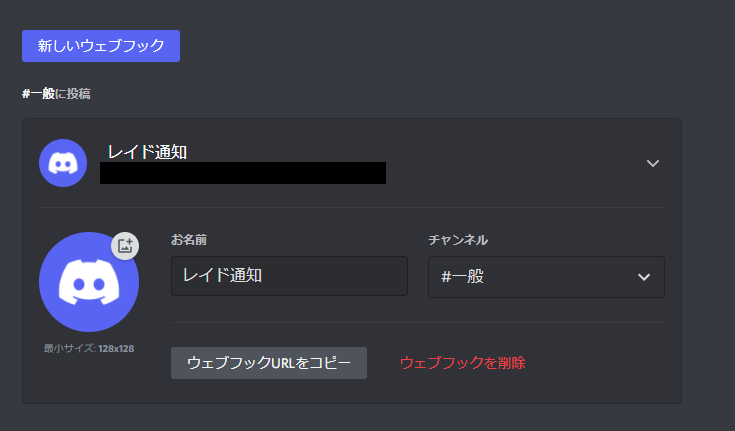
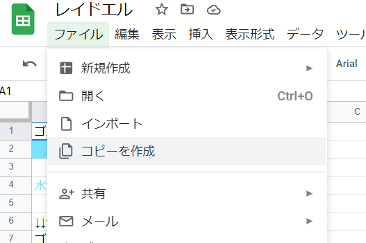
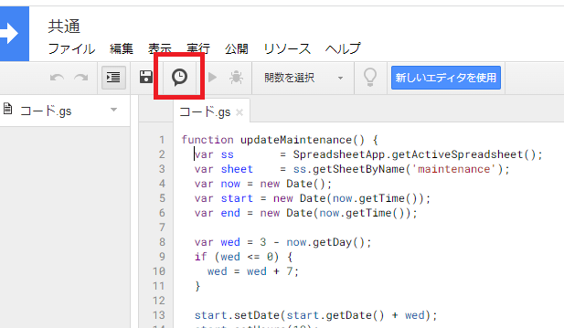
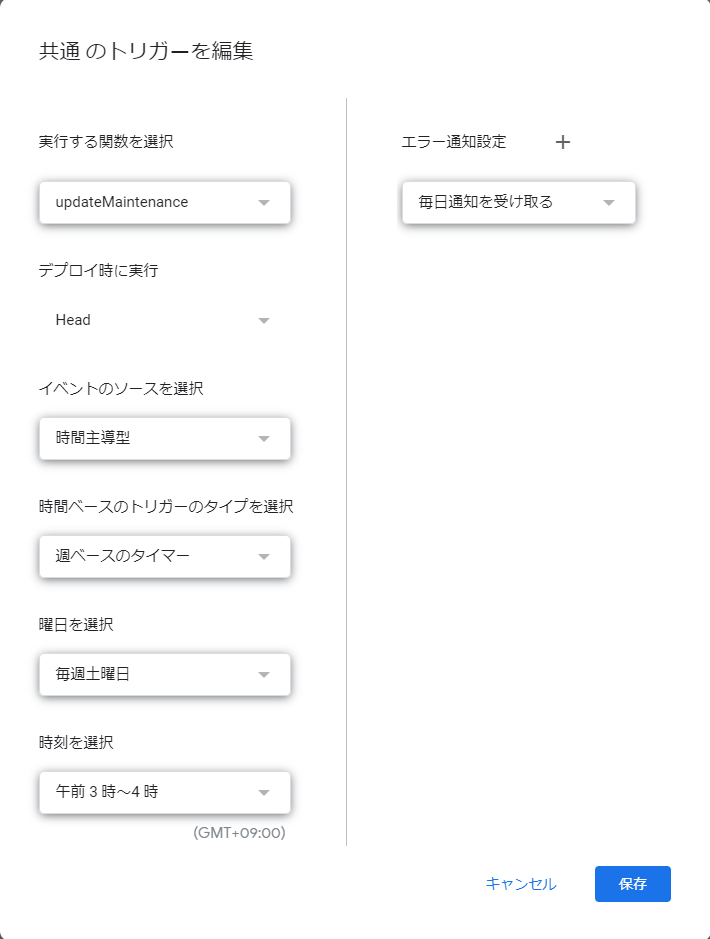
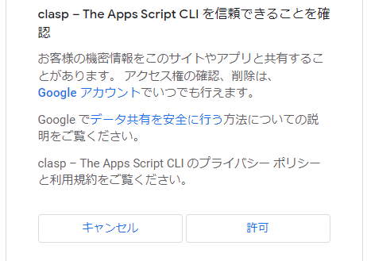
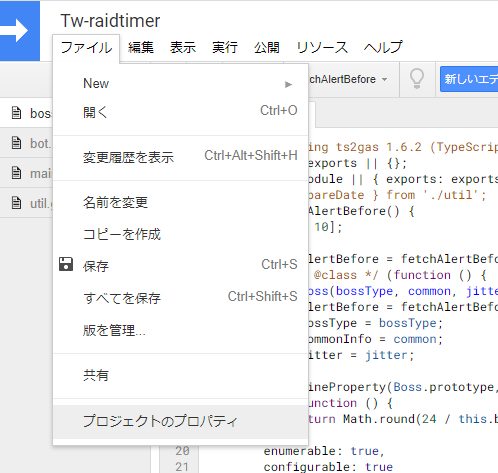
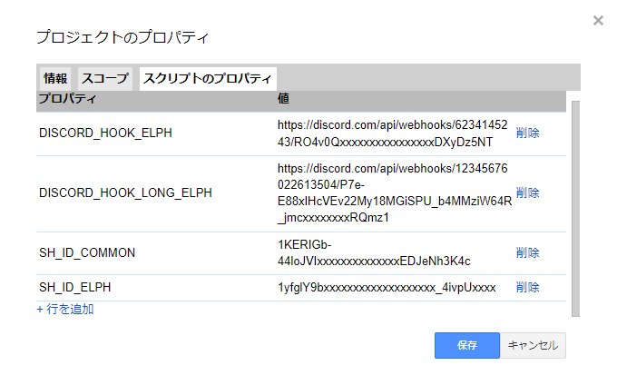
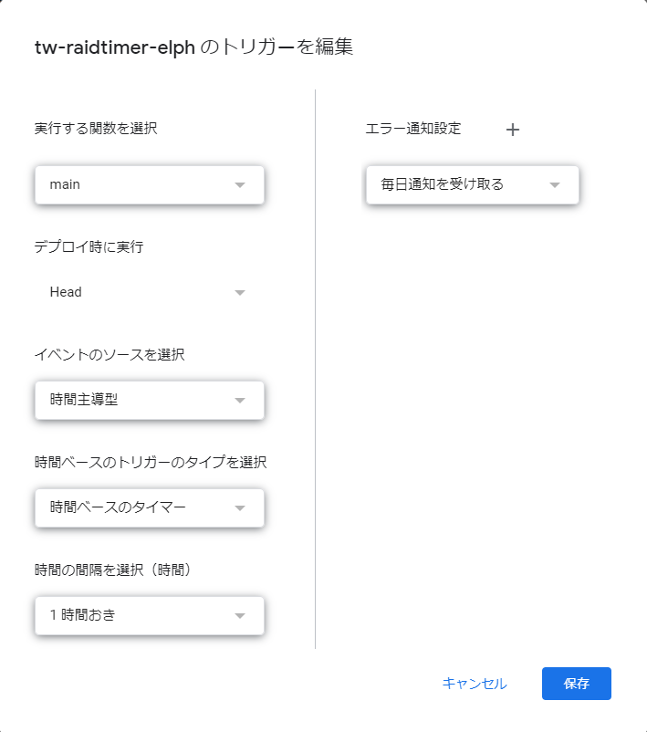
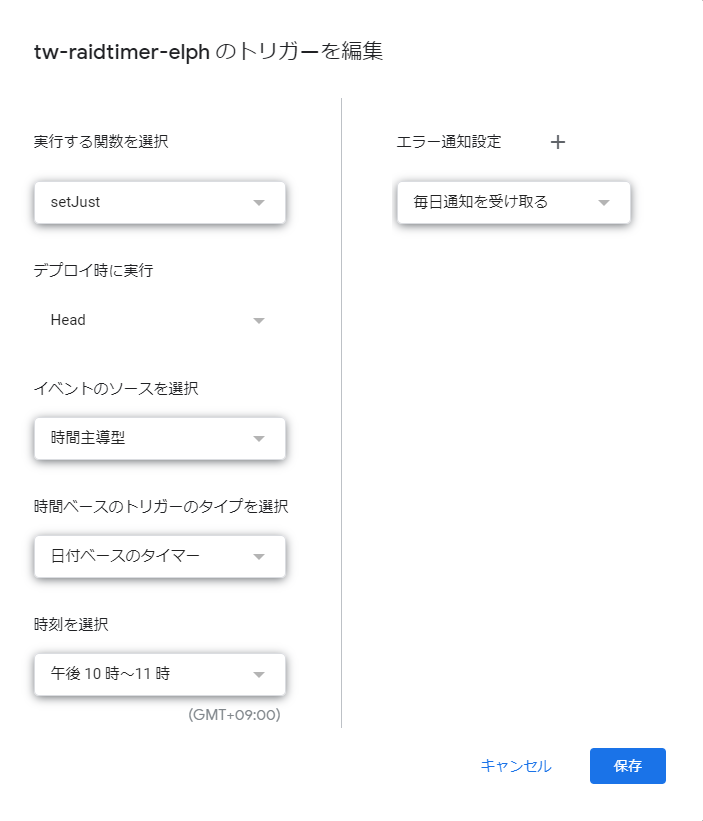

# TW レイドタイマーの設定方法

## Discord サーバーの設定

### サーバーの作成

通知に利用する Discord のサーバーを作成してください。既存のサーバーで通知したい場合は新規作成は不要です。

### WebHook の設定

Discord の WebHook を作成します。

サーバーの設定 → 連携サービス → ウェブフック → 新しいウェブフックをクリックすることで作成されます。

名前や通知したいチャンネルや画像などは適宜設定してください。



ウェブフックの URL をコピーしてどこかにメモしておきます。

5 分前通知と 10 分前通知のチャンネルを分ける場合は、同様な手順でもう一つ作成します。

## スプレッドシートの準備

### 時間管理用のスプレッドシートの作成

以下を開き、ファイル → コピーを作成でスプレッドシートのコピーを作成してください。

https://docs.google.com/spreadsheets/d/1x29_x3Um2YHW8k2v3qUTxhI7PIQX01Aznku7O9Y7jVI/edit



コピーした後の URL の以下の xxxxxxx...の部分をコピーしてどこかにメモしておきます。これが、「時間管理用のスプレッドシートのシート ID」となります。

`https://docs.google.com/spreadsheets/d/xxxxxxxxxxxxxxxxxxxxxxxxxxxxxxxxxxxxxxxxx/edit`

こちらのシートを利用して、ボスが沸いた時刻を更新していきます。

### メンテ時間管理用のスプレッドシートの作成

以下を開き、同様にコピーを作成します。

https://docs.google.com/spreadsheets/d/1KERIGb-44loJVIU5sq0pm3ZlHfSRfEGqzEDJeNh3K4c/edit

コピーした後の URL の以下の xxxxxxx...の部分をコピーしてどこかにメモしておきます。これが、「メンテ時間管理用のスプレッドシートのシート ID」となります。

`https://docs.google.com/spreadsheets/d/xxxxxxxxxxxxxxxxxxxxxxxxxxxxxxxxxxxxxxxxx/edit`

#### メンテ時間更新のトリガー作成

メンテ時間管理用のシートの拡張機能 →Apps Script を選択して、スクリプト編集画面に移動します。

時計のアイコンをクリックしてトリガー編集画面に移動します。



トリガーの作成から、以下のようなトリガーを設定します。

これにより、定期メンテナンスの時刻が自動で設定されるようになります。



**※メンテナンス時間が変更になった場合は、手動でスプレッドシートの時刻を変更する必要があることに注意してください。**

## スクリプトの設定

### 必要なツール

- Git
  - https://gitforwindows.org/
- Node.js
  - https://nodejs.org/ja/
- Yarn
  Node.js(NPM)をインストールした後に、PowerShell 等を開いて以下コマンドでインストールされます
  ```
  npm install -g yarn
  ```

**以下では、コマンド実行する際は、PowerShell 上で実行することを前提とします。**

### ソースコードの取得

PowerShell で任意のフォルダで以下コマンドを実行

```
git clone https://github.com/omatztw/tw-raidtimer.git
cd tw-raidtimer
yarn install
```

必要なライブラリがインストールされるので、しばらく待機します。

### clasp プロジェクトの作成

本スクリプトは claps の使用を前提に作られています。clasp とは、Google Apps Script(GAS)を開発しやすくするツールです。

#### clasp へのログイン

```
yarn run clasp login
```

ここで、ブラウザが起動し、Google アカウントへのログインを促されます。自分の Google アカウントでログインしてください。

ログインすると、以下のような画面になるので、許可をクリックしてください。



### clasp プロジェクトの作成

```
yarn run clasp create tw-raid-timer-elph
```

※tw-raid-timer-elph の部分は任意の名前で OK です

以下のような選択肢が出たら、「standalone」を選択して Enter を押します。

```
? Create which script? (Use arrow keys)
❯ standalone
  docs
  sheets
  slides
  forms
  webapp
  api
```

以下のような表示になったら成功です。

```
? Clone which script? standalone
Created new standalone script: https://script.google.com/d/xxxxxxxxxxxxxxxxxxxxxxxxxxxxxxxx/edit
```

### clasp コードの push

`.clasp.json`というファイルが生成されているので、メモ帳などで開き以下のように編集（追記）します。  
**scriptId の部分は変更しないでください**

```json
{
  "scriptId": "xxxxxxxxxxxxxxxxxxxxxxxxxxxxxxxxxxxxxxxxxxxxxxxxxxxxxx",
  "rootDir": "./src",
  "fileExtension": "ts"
}
```

以下コマンドを実行してコードを更新します。

```
yarn run clasp push
```

※「? Manifest file has been updated. Do you want to push and overwrite?」とでたら、[y]を押して進めてください

以下のような表示になったら成功です。

```
? Manifest file has been updated. Do you want to push and overwrite? Yes
└─ src/appsscript.json
└─ src/boss.models.ts
└─ src/bot.models.ts
└─ src/main.ts
└─ src/util.ts
Pushed 5 files.
Done in 5.16s.
```

### プロパティの設定

https://script.google.com/home にアクセスして、「Tw-raidtimer」というスクリプトが生成されていることを確認しましょう。

「Tw-raidtimer」をクリックするとスクリプト編集画面に移動します。  
ここで、右上に「クラシックエディタを使用する」という表示がある場合は、クリックしてクラシックエディタに変更してください。新しいエディタではプロパティの作成ができないためです。

以下のように、ファイル → プロジェクトのプロパティと進みます。



以下のプロパティをそれぞれ設定します。

| プロパティ名             | 説明                                          |
| :----------------------- | :-------------------------------------------- |
| DISCORD_HOOK_SERVER      | Discord の Webhook の URL(5 分前通知用)       |
| DISCORD_HOOK_LONG_SERVER | Discord の Webhook の URL(10 分前通知用)      |
| SH_ID_SERVER             | 時間管理用のスプレッドシートのシート ID       |
| SH_ID_COMMON             | メンテ時間管理用のスプレッドシートのシート ID |

「SERVER」の部分は、適宜サーバー名に変換してください。可能な文字列は以下の通りです。

- ELPH
- ROSE
- MOEN

  なお、通知する文字列が変化するだけなので、必ずしも実際のサーバーと一致させる必要はありません。

「ELPH」を用いた設定の場合、以下のようになります。



### トリガーの設定

通知時刻の調整のために、いくつかトリガーを設定します。

https://script.google.com/home から、「Tw-raidtimer」のスクリプトを選択します。

時計アイコンをクリックしてトリガーの設定に移動します。


#### main トリガー

メインのトリガーです。このトリガーによって、通知の時刻が調整されています。

1 時間おきに起動することで、毎時調整させています。



#### setJust トリガー

0 時に当日の通知を設定するためのトリガーです。  
正確には、当日の通知を設定するためのトリガーを設定するためのトリガーです。



## 応用

### 時刻更新を自動化する

Coming soon...
